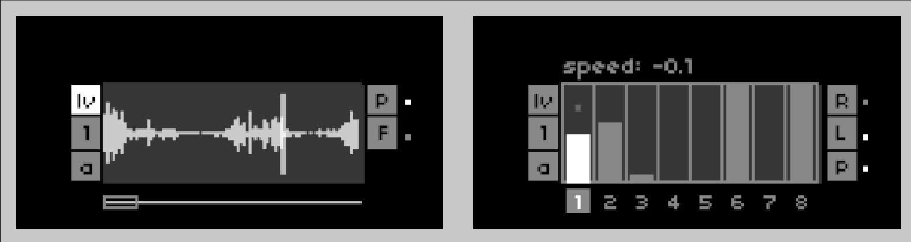

# latkes
granular processor for live and recorded audio

latkes expands upon @infinitedigits [granchild](https://llllllll.co/t/granchild/41894/) script and includes these key features:

* four voices/four scenes per voice
* four playheads per voice
* four 30s buffers per voice
* eight gesture recorders per voice/scene
* attack decay grain envelopes

# requirements
* norns
* 128 grid (optional)
* midi-controller (optional)

# documentation

~ ~ ~ ~ ~  > read the [laktes user guide](docs/latkes_user_guide_v_0.1.0.pdf)

screen 1 (waveform viewer)
* E1: switch between screens
* E2: select control
* K2/K3: change control value

screen 2 (gesture recorder)
* E1: switch between screens
* E2: select control
* E3: change control value
* K1+E3: record selected param 

# install
from maiden:

`;install https://github.com/jaseknighter/latkes`

after installing, restart norns and reload the script again. 

